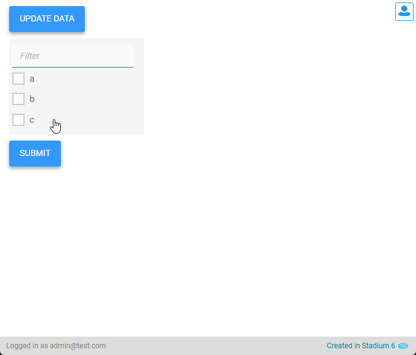

# CheckBox List Filter

When checkbox lists contain many items, finding an item can be cumbersome and frustrating. Here is a simple example of how to add a filter to a checkbox list. 



# Version 
1.0 - initial

1.0.1 Added max-height variable (CSS only)

1.0.2 Added input background color variable (CSS only)

1.1 Fixed duplicating filterinput bug

1.2 Integrated CSS into script

## Application Setup
1. Check the *Enable Style Sheet* checkbox in the application properties

## Global Script Setup
1. Create a Global Script called "CheckBoxListFilter"
2. Drag a JavaScript action into the script
3. Add the Javascript below unchanged into the JavaScript code property
```javascript
/* Stadium Script v1.2 https://github.com/stadium-software/checkbox-list-filter */
loadCSS();
let checkboxList = document.querySelectorAll(".filterable-checkbox-list");
for (let i = 0; i < checkboxList.length; i++) {
    let checkboxListFilter = checkboxList[i].querySelector(".checkbox-list-filter");
    if (checkboxListFilter) continue;
    let filterField = document.createElement("input");
    filterField.classList.add("form-control", "error-border", "text-box-input", "checkbox-list-filter-input");
    filterField.setAttribute("placeholder", "Filter");
    filterField.addEventListener("keyup", filterCheckBoxList);
    let filterFieldContainer = document.createElement("div");
    filterFieldContainer.classList.add("control-container", "text-box-container", "checkbox-list-filter");
    filterFieldContainer.appendChild(filterField);
    let filterClear = document.createElement("div");
    filterClear.classList.add("clear-list-filter");
    filterClear.addEventListener("click", resetFilter);
    filterFieldContainer.appendChild(filterClear);
    checkboxList[i].prepend(filterFieldContainer);
}
function filterCheckBoxList(e) {
    let hasResults = false;
    let input = e.target;
    let checkboxListFilter = input.closest(".checkbox-list-filter");
    if (input.value) checkboxListFilter.querySelector(".clear-list-filter").style.display = "block";
    let container = input.closest(".check-box-list-container");
    removeMsg(container);
    let checkboxes = container.querySelectorAll(".checkbox");
    for (let i = 0; i < checkboxes.length; i++) {
        checkboxes[i].style.display = "block";
        let txt = checkboxes[i].querySelector("label").textContent;
        if (txt.indexOf(input.value) == -1) {
            checkboxes[i].style.display = "none";
        } else {
            hasResults = true;
        }
    }
    if (!hasResults) {
        let msg = document.createElement("div");
        msg.innerHTML = "No matching items";
        msg.classList.add("checkbox-list-message");
        insertAfter(checkboxListFilter, msg);
    }
}
function resetFilter(e) {
    let container = e.target.closest(".check-box-list-container");
    removeMsg(container);
    container.querySelector(".checkbox-list-filter-input").value = "";
    let checkboxes = e.target.closest(".check-box-list-container").querySelectorAll(".checkbox");
    for (let i = 0; i < checkboxes.length; i++) {
        checkboxes[i].style.display = "block";
    }
    e.target.style.display = "none";
}
function removeMsg(cont) {
    if (cont.querySelector(".checkbox-list-message")) cont.querySelector(".checkbox-list-message").remove();
}
function insertAfter(referenceNode, newNode) {
    referenceNode.parentNode.insertBefore(newNode, referenceNode.nextSibling);
}
function loadCSS() {
    let moduleID = "stadium-checkbox-list-filter";
    if (!document.getElementById(moduleID)) {
        let cssMain = document.createElement("style");
        cssMain.id = moduleID;
        cssMain.type = "text/css";
        cssMain.textContent = `
.check-box-list-container {
    .checkbox-list-filter {
        display: block;
        margin-left: 0.4rem;
        position: relative;
        max-width: var(--checkbox-list-filter-max-width, var(--FORM-CONTROL-DEFAULT-WIDTH));
        
        .checkbox-list-filter-input {
            width: 100%;
            padding: 0.8rem var(--checkbox-list-filter-clear-icon-size, 2.6rem) 0.8rem 1.2rem;
            background-color: var(--checkbox-list-filter-input-background-color, var(--FORM-CONTROL-BACKGROUND-COLOR));
            border-bottom-color: var(--FORM-CONTROL-BORDER-BOTTOM-COLOR, initial);
        }
    
        .clear-list-filter {
            position: absolute;
            right: calc(var(--checkbox-list-filter-clear-icon-size, 2.6rem) / 2);
            top: 0;
            display: none;
            cursor: pointer;
            height: 100%;
            width: var(--checkbox-list-filter-clear-icon-size, 2.6rem);
            background-image: var(--checkbox-list-filter-clear-icon, url("data: image/svg+xml;base64,PHN2ZyB4bWxucz0iaHR0cDovL3d3dy53My5vcmcvMjAwMC9zdmciIHdpZHRoPSIxZW0iIGhlaWdodD0iMWVtIiB2aWV3Qm94PSIwIDAgMjQgMjQiPjxwYXRoIGZpbGw9IiM3Nzc3NzciIGQ9Im0xMiAxMy40bC0yLjkgMi45cS0uMjc1LjI3NS0uNy4yNzV0LS43LS4yNzV0LS4yNzUtLjd0LjI3NS0uN2wyLjktMi45bC0yLjktMi44NzVxLS4yNzUtLjI3NS0uMjc1LS43dC4yNzUtLjd0LjctLjI3NXQuNy4yNzVsMi45IDIuOWwyLjg3NS0yLjlxLjI3NS0uMjc1LjctLjI3NXQuNy4yNzVxLjMuMy4zLjcxM3QtLjMuNjg3TDEzLjM3NSAxMmwyLjkgMi45cS4yNzUuMjc1LjI3NS43dC0uMjc1LjdxLS4zLjMtLjcxMi4zdC0uNjg4LS4zeiIvPjwvc3ZnPg=="));
            background-repeat: no-repeat;
            background-position: center;
            background-size: var(--checkbox-list-filter-clear-icon-size, 2.6rem);
        }
    }
    > div:not(.checkbox-list-filter) {
        max-height: var(--checkbox-list-max-height, 30rem);
        overflow: auto;
        width: 100%;
    }
    .checkbox-list-message {
        margin: 0.8rem 1.2rem;
    }
}
html {
    min-height: 100%;
    font-size: 62.5%;
}        
        `;
        document.head.appendChild(cssMain);
    }
}
```

## Checkbox List Setup
1. Drag a CheckBoxList Control to the page
2. Add the classname 'filterable-checkbox-list' to the control classes property
3. Populate the CheckBoxList with data

## Page.Load Event Setup
1. Drag the "CheckBoxListFilter" script into the Page.Load event
2. The filter matches strings using *Contains* and is case sensitive

## CSS
Variables exposed in the [*checkbox-list-filter-variables.css*](checkbox-list-filter-variables.css) file can be [customised](#customising-css).

### Customising CSS
1. Open the CSS file called [*checkbox-list-filter-variables.css*](checkbox-list-filter-variables.css) from this repo
2. Adjust the variables in the *:root* element as you see fit
3. Stadium 6.12+ users can comment out any variable they do **not** want to customise
4. Add the [*checkbox-list-filter-variables.css*](checkbox-list-filter-variables.css) to the "CSS" folder in the EmbeddedFiles (overwrite)
5. Paste the link tag below into the *head* property of your application (if you don't already have it there)
```html
<link rel="stylesheet" href="{EmbeddedFiles}/CSS/checkbox-list-filter-variables.css">
``` 
6. Add the file to the "CSS" inside of your Embedded Files in your application

## Upgrading Stadium Repos
Stadium Repos are not static. They change as additional features are added and bugs are fixed. Using the right method to work with Stadium Repos allows for upgrading them in a controlled manner. 

How to use and update application repos is described here: [Working with Stadium Repos](https://github.com/stadium-software/samples-upgrading)